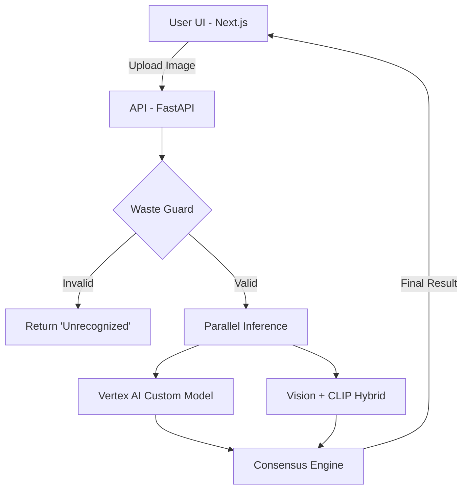

# ♻️ WasteML Compare

[](https://fastapi.tiangolo.com/)
[](https://nextjs.org/)
[](https://cloud.google.com/vertex-ai)
[](https://openai.com/research/clip)

**WasteML Compare** is a professional-grade demonstration platform designed to evaluate and compare multiple machine learning approaches for waste segregation. It highlights the difference between specialized Custom Models (Vertex AI) and Hybrid Pre-trained Engines (Google Vision + OpenAI CLIP).

---

## ✨ Key Features

-   **🧠 Multi-Model Consensus**: Compares predictions from specialized Vertex AI models and a hybrid Vision/CLIP engine to provide a "Reliability Score."
-   **🛡️ Waste Guard**: An intelligent filter that detects and blocks non-waste items (e.g., fruits, vehicles, animals) to prevent false positives.
-   **⚡ Real-time Performance Tracking**: Measures and visualizes inference latency for each model side-by-side.
-   **🔍 Descriptive Insights**: Provides top-tier visual labels from Google Vision API with CLIP-based zero-shot classification as a robust fallback.
-   **📱 Responsive Dashboard**: A sleek, modern UI built with Next.js, optimized for both desktop and mobile use.

---

## 🛠️ Tech Stack

-   **Frontend**: Next.js 14, React, Vanilla CSS3 (Custom Design System).
-   **Backend**: FastAPI (Python 3.9+), Uvicorn.
-   **ML Inference**:
    -   **Custom**: Google Vertex AI.
    -   **Pre-trained**: Google Cloud Vision API.
    -   **Zero-Shot**: OpenAI CLIP (Feature extraction).
-   **DevOps**: Docker ready, Environment-based configuration.

## 🚀 Quick Start (Running After Pull)

If you have already pulled the repository and have your environment configured, use these commands to start the application:

### 1. Start Backend
```bash
cd backend
source .venv/bin/activate  # Activate your environment
uvicorn main:app --reload --port 8000
```

### 2. Start Frontend
```bash
cd frontend_legacy_basic
npm run dev -- -p 3001
```

---

## 🛠️ Detailed Setup Guide

### Prerequisites

-   Python 3.9 or higher
-   Node.js 18 or higher
-   Google Cloud project with Vertex AI and Vision API enabled
-   A valid service account JSON key

### 1. Backend Setup

```bash
cd backend

# Create and activate virtual environment
python3 -m venv .venv
source .venv/bin/activate  # On Windows: .venv\Scripts\activate

# Install dependencies
pip install -r requirements.txt

# Configure Environment
cp .env.example .env
# Edit .env with your Google Cloud credentials and project details
```

**Run Backend:**
```bash
uvicorn main:app --reload --port 8000
```

### 2. Frontend Setup

```bash
cd frontend_legacy_basic

# Install dependencies
npm install

# Configure API Endpoint
echo "NEXT_PUBLIC_API_BASE=http://localhost:8000" > .env.local
```

**Run Frontend:**
```bash
npm run dev -- -p 3001
```

Access the application at [http://localhost:3001](http://localhost:3001).

---

## 🏗️ Project Architecture



---

## 📂 Project Structure

-   `backend/`: FastAPI application, service layers, and ML logic.
    -   `app/`: Core services (Vertex, Vision, CLIP).
    -   `static/`: Static assets for the legacy fallback UI.
    -   `main.py`: Main API entry point.
-   `frontend_legacy_basic/`: The primary Next.js application.
    -   `app/`: React components and page logic.
-   `dataset/`: (Optional) Sample images for testing.

---

